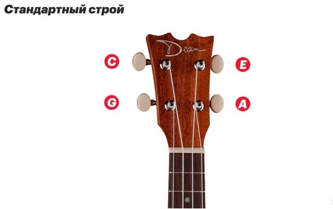
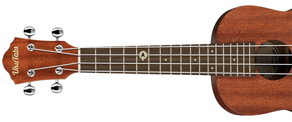
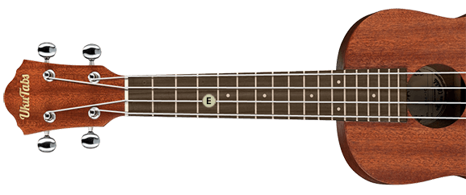
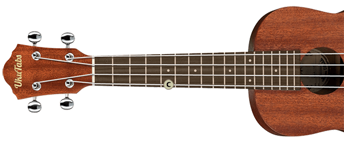
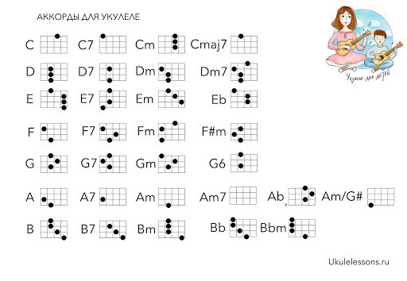
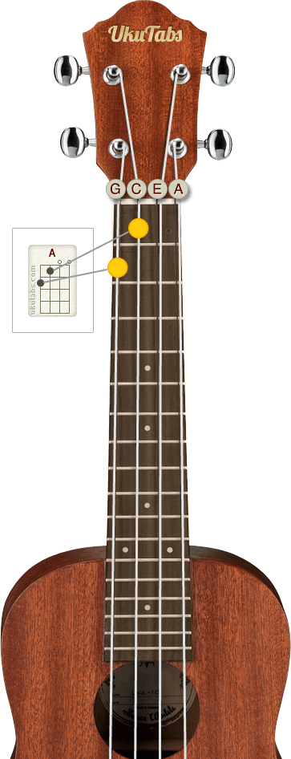

# У меня теперь есть укулеле!
Huawind 21-дюймовое укулеле сопрано. Оно нубское, но я и не спец по укулеле.

Вот так оно выглядит
## Информационная сводка 🧐
Укулеле — четырёхструнный щипковый музыкальный инструмент.

>Подобие данного музыкального инструмента появилось в середине XV века в Европе. Гитары и мандолины были дорогими, поэтому появились упрощённые гитары — кавакинью, обладающие меньшим размером ( с 4 струнами и 12 ладами).

Во второй половине XIX века под названием машети да браса была завезена португальцами с острова Мадейра на Гавайские острова.

А на Гавайях инструмент получил своё новое название — «Укулеле», что переводится как «скачущая блоха». Изготавливать инструмент начали из гавайской акации — Коа, которая считается символом островов.

Мое укулеле гитарообразной формы, а есть ещё формы «ананас».

### В зависимости от размера, есть несколько видов укулеле.

У меня сопрано
Сопрано в длину 55см, концерт — 62, тенор, — 67. Эти размеры примерные и они могут отличаться в зависимости от бренда. От размера также зависит длина грифа.

Чем он длиннее, тем больше звуков можно извлечь. Чем он уже, тем легче брать баррэ.

---
## Настройка
Мне привычна 6-струнная гитара «ehgdae». Что удивило меня в укулеле, последняя 4-я струна в нем высокая, по классической настройке. Но можно использовать и G низкую.

И так **алгоритм настройки**:

- Добиться идеального звучания ноты ля (A) – важно, чтобы она звучала правильно, ведь от нее будут настраиваться остальные струны.

- Зажать 2 струну ми (E) на 5 ладу и добиться одинакового звучания с чистой 1 струной.

- Зажать 3 струну до (C) на 4 ладу: она должна звучать, как 2 чистая.

- Зажать 4 струну соль (G) на 2 ладу и сверить ее с 1 струной.

- Если надо настроить 4 струну низкую, то надо зажать 4 струну на 5 ладу и сравнить ее с 3 струной.

Материал взят [отсюда](https://ukuguides.com/maintenance/how-to-properly-tune-your-ukulele/).

Укулеле также можно настраивать в строй гитаре. В таком случае, звук будет идентичен первым струнам стандартной гитары EHGD.

---
## Собственно игра
Между ладами маленькое расстояние и непривычно зажимать. Надо привыкнуть. Не представляю пока, как можно на нем играть, кроме брыньканья. Ну и струны новые, постоянно расстраиваются. 

### Основные аккорды для брынчания

 

Читаются табы очень просто: они представляют из себя рисунок грифа с ладами и струнами, а точки показывают, где эти струны надо зажимать.

 

Номер рядом с ладом показывает его, собственно, номер, чтоб не рисовать весь гриф. По-умолчанию, без указания номера, представлены первые 4 лада.

[Тут](https://i2.wp.com/ukuchords.com/files/UkuChords_Complete180ChordChartsPoster_Standard.png) чуть больше аккордов.
А [это](https://ukutabs.com/?ref=tjournal.ru) — неплохой сайт с аккордами для укулеле и всякими туториалами.
