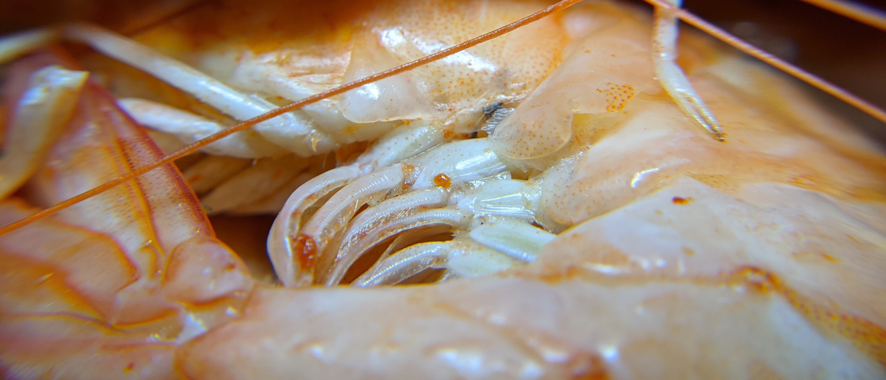

# Креветки с соусом Терияки

Поделюсь рецептом сего замечательного лакомства. Основная «соль», конечно в самом соусе.

* * *

## Креветки

Мы просто варили. Не жарили в самом соусе. Но вы, конечно, можете делать по-другому.

1.  Довести воду до кипения.
2.  Можно добавить специи (соль, сахар, перец, лавровый лист и т.д.)
3.  В кипящую воду кидаются креветки и варятся, пока у всех не начнут «сворачиваться» хвостики (в форме буквы «С»): маленьким креветкам хватает минуты, средним — 1-2, а крупным — 2-5. Долго варить их тоже не надо (если хвостики свернулись в кружок, то переварили).

* * *

## Соус Терияки

Покупать же готовый «не тру». Поэтому вот рецепт своего.

### Небольшая информационная сводка

> Тэрияки (яп. テリヤキ, kanji: 照り焼き) is) — традиционный японский способ обжарки с использованием распространённого в японской кухне сладкого соуса. Слово тэрияки происходит от существительного тэри (яп. 照り), означающего блеск, и яки (яп. 焼き) — жареное.

### Сам рецепт соуса

**Ингредиенты:**

- Соевый соус — 2 столовые ложки.
- Кулинарное саке — 2 столовые ложки.
- Мирин — 2 столовые ложки.
- Сахар — 1 столовая ложка.

**Другой вариант:**

- Соевый соус — 20 мл.
- Саке — 20 мл.
- Мирин — 30 мл.
- Сахар — 5 г.

В народных рецептах есть и вино, и мед, и чеснок, но это уже не по-японски выходит.

> *Кулинарное саке (ryorishu, 料理 酒)* — саке, в которое добавляют 2-3% соли, что делает невозможным его прямое употребление, но позволяет готовить на его основе.
> 
> *Мирин (味醂, или みりん)* — очень сладкое рисовое вино, используемое в японской кулинарии. Гугл переводит, как «сладкое саке».

**Процесс приготовления**

Налить/высыпать все ингредиенты на сковороду и кипятить на среднем огне до загустения.

Если загустить по какой-то причине не получилось, то в некоторых рецептах советуют добавлять крахмал.

Оригинальный рецепт можно посмотреть, например, [тут](https://www.kurashiru.com/recipes/e488ced9-0e5c-49a9-a985-4eb6813a88fc).

* * *

Готово! Вы великолепны! Теперь это можно употреблять с пивком, например.
