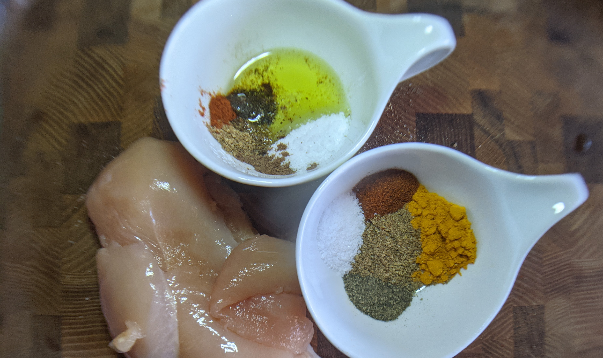

# Несколько рецептов шаурмы
Кто не знает это блюдо, состоящее из мяса, приправ и добавок, завёрнутых в лаваш? И это не секрет, что в разных локациях рецепт (и название) у данного ближневосточного кулинарного шедевра отличается.
Лично мне удалось попробовать шаурму пока только в трёх странах, и в каждой она была по-своему великолепна.
Речь пойдет о шаурме с курицей, но естественно мясо можно использовать другое.

# Процесс приготовления

Он для всех видов одинаковый:
- Маринуем (лучше в течении ночи) куриное мясо.
- Жарим его и нарезаем.
- Готовим салат (огурцы, капуста, помидоры и т.д.)
- Готовим соус.
- Смазываем соусом хлеб, добавляем туда всю начинку, еще немного соуса и заворачиваем.

Отличие всех рецептов в маринаде, соусе, салате и типе используемого хлеба. Везде все ингредиенты салата - опциональные.

# Шаурма "стандартная"

**Уровень сложности:** Explorer Mode.

Вот именно такая стандартная, которую можно купить в ларьке у универа или рядом с торговыми рядами. Не специфические верианты из ресторанов или знаменитых шаурмячных.

Сразу скажу, что я из Украины, и рецепт может отличаться от то, что обычно готовят в РФ (хотя сомневаюсь). Из особенностей: мне редко попадались такие экземпляры, где в начинку шли свежие овощи, кроме белокочанной капусты.

**Потенциальные проблемы:** качество лаваша (слишком тонкий и ломкий).

## Маринад:
- соль;
- лук/майонез/перец.

## Соус:
- Майонез или кетчунез. Мазик иногда разводят водой, чтоб был пожиже.

## Салат:
- квашеные/маринованные огурцы;
- морковь "по-корейски";
- белокочанная капуста;
- жареная картошка

## Хлеб:
- армянский (тонкий) лаваш

---

# Шаурма армянская

**Уровень сложности:** Classic Mode.

Отличается приятным йогуртовым соусом (опционально) и остротой (во время жарки мяса дым от перца чили заполонил всю нашу квартиру). Мы пробовали данную шаурму в "Shaurma Club" Bistro (7 Amiryan st. Yerevan, Armenia).

**Потенциальные проблемы:** те же что и у стандартной - качество лаваша.

## Маринад:
- соль;
- перец чили
- хмели-сунели;
- растительное масло.

## Соус 1: 
- 250 г. майонеза
- 1 ч.л. перца чили
- паприка, острый перец

## Соус 2:
- орегано щепотку;
- 1 зубчик чеснока;
- Мацони (йогурт, греческий йогурт).

## Салат:
- белокочанная капуста;
- чайная ложка уксуса;
- лимонный сок;
- немного соли;
- репчатый лук;
- картошка;
- можно свежие помидоры, огурцы.
Порезанную соломкой капусту маринуют чайной ложкой уксуса, лимонным соком и солью. Смешивают, выжимая.

## Хлеб:
- армянский (тонкий) лаваш, пита.

---

# Шаварма израильская

**Уровень сложности:** Honor Mode.

Отличительной особенностью является наличие хумуса и тахини. Самая вкусная шаварма, которую нам удалось попробовать, была в "Jasmino" (Allenby 99, Tel-Aviv, Israel). Питу они там пекли, а тахини выливался со всех сторон, но она была очень вкусной и сытной.

Подается в пите. По два-три раза выкладываются слои хумуса, мяса, двух салатов, тахини и амба (опционально).

**Потенциальные проблемы:** муторное приготовление питы, которую часть нет возможности купить, тахини выливается изо всех щелей, сложно найти все необходимые специи.

## Маринад 1:
- 1/3 стакана рапсового масла;
- 1 столовая ложка куркумы;
- 1 столовая ложка молотого кориандра;
- 1 чайная ложка чесночного порошка;
- 1 чайная ложка тмина;
- 1 чайная ложка паприки;
- 1/4 чайной ложки корицы;
- 1/4 чайной ложки молотой гвоздики;
- 1 чайная ложка соли;
- 1/2 чайной ложки черного перца.

## Маринад 2:
- 1/2 чайной ложки кориандра;
- 1/4 чайная ложка корицы;
- 1/4 чайная ложка тмина;
- 1/4 чайная ложка кардамона;
- 1/4 чайная ложка черного перца;
- щепотка мускатного ореха;
- щепотка измельченного красного перца;
- 2 чайные ложки соли;
- 1 столовая ложка оливкового масла.

## Соус:
- тахини;
- хуммус;
- амба (опционально) - соус из маринованных манго и специй, распространенный в кухне Индии, Ближнего Востока и стран бассейна Персидского залива. 

## Салат 1:
- 2 помидора, нарезанные кубиками;
- 4 персидских огурца, нарезанных кубиками;
- 1 нарезанный перец Серрано (без семян, если вы предпочитаете менее острый);
- 2 столовые ложки лимонного сока;
- 1 столовая ложка оливкового масла;
- красный лук;
- соль по вкусу.

## Салат 2:
- 1/2 тонко нарезанного красного лука;
- 1 столовая ложка сумаха;
- 1/4 чайная ложка соли;
- 1 столовая ложка лимонного сока.

## Хлеб:
- пита.

## Тахини соус 1
- 1/2 стакана (120 г) пасты Тахини.
- 1/4 стакана (60 мл) воды.
- 1 столовая ложка рубленого чеснока.
- 4 столовые ложки (60 мл) лимонного сока.
- 1/2 чайной ложки соли.

## Тахини соус 2
- 1/3 стакана холодной воды;
- 1/3 стакана свежего лимонного сока;
- 1/2 стакана пасты тахини;
- соль по вкусу.

1. В миску добавьте пасту тахини, чеснок, соль, перец и лимонный сок.
2. Добавьте 3/4 стакана воды и перемешайте до однородной массы.
3. Отрегулируйте приправу - добавьте больше соли, перца или лимонного сока по вкусу.
4. Проверьте консистенцию - при необходимости добавьте воды.
5. Вылейте в емкость.
6. Сбрызните оливковым маслом и посыпьте перцем.

Оригинальный рецепт [тут](https://www.haaretz.com/food/.premium-how-to-make-shawarma-like-an-israeli-1.5467110) и [тут](https://www.touchpointisrael.com/2018/05/22/recipe-homemade-shawarma/).
---

# Рецепт питы

## Ингредиенты
- 0,5 столовой ложки соли;
- 0,5 кг муки;
- 3/4 столовой ложки сухих дрожжей;
- 2 ст.л. сахар;
- 1 1/4 стакана теплой воды;
- 1/4 стакана растительного масла.

## Процесс приготовления
1. Насыпьте соль на дно миксерной чаши.
2. Просейте муку и посыпьте дрожжами и сахаром.
3. Налейте туда два стакана воды и подождите две минуты.
4. Месите, пока вся вода не впитается в муку.
5. Добавьте оставшуюся воду (при необходимости еще немного) до получения мягкого и пластичного теста.
6. Выньте тесто из чаши и продолжайте месить на слегка посыпанной мукой рабочей поверхности, пока тесто не станет мягким и без комков.
7. Сформируйте из теста гладкий шар и верните в миску. 
8. Накройте полиэтиленовой пленкой или влажным полотенцем и оставьте на час в теплом месте, пока объем не увеличится вдвое.
9. Когда тесто поднимется, взбейте его кончиками пальцев и еще немного вымесите, чтобы выпустить воздух.
10. Смажьте рабочую поверхность или большой противень небольшим количеством масла и смазанными маслом руками сформируйте из кусочков теста кусочки размером с мяч для гольфа.
11. Разместите их рядом, но не слишком близко, так как им нужно место, чтобы подняться. Накройте полиэтиленовой пленкой или влажным полотенцем и дайте подняться еще полчаса.
12. Затем возьмите один из шариков и расплющите его руками о смазанную маслом рабочую поверхность. Таким же образом приготовьте еще один кружок теста.
13. Поместите второй кружок теста поверх другого и защипните края. *В оригинальном рецепте это не было указано, но сама пита должна быть достаточно тонкой. Для этого мне пришлось раскатать скалкой. Тут только не надо сильно переусердствовать, чтоб две лепешки не слиплись.*
14. Пожарить на плоской сковороде без масла до румяных корочек обе стороны каждой питы. *Опять же в результате жарки вышло пита вышла немного не с той корочкой. Поэтому по-моему лучше печь ее в печи минут 20 при температуре 200 градусов, как это делали в кафе Тель-Авива*

Оригинальный рецепт [тут](https://www.google.com/amp/s/www.haaretz.com/amp/food/middle-eastern-stuffed-pitas-3-recipes-1.5367145).